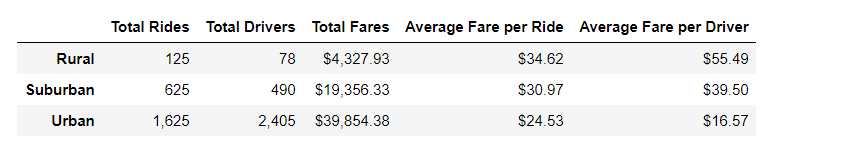
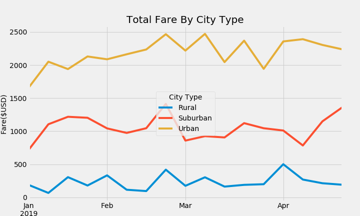

# PyBer_Analysis
## Project Overview
A Pyber Ride Sharing company requires it data analyst to analyze the data to create the visualization report about the following:
1.	Calculate the summary statistics for Rides per city type ,Fare per city type and number of drivers per city type.
2.	Create a visualization charts for the summary statistics.
3.	Calculate the percentage of total rides by city type and pie chart to represent it.
4.	Calculate the percentage of total fares by city type and pie chart to represent it.
5.	Calculate the percentage of total drivers by city type and pie chart to represent it.
## Resources
- Data Source: city_data.csv and  ride_data.csv
- Software: Python 3.6.1, Pandas Library, Jupyter Notebook and Matplotlib
  
## Challenge Overview
The challenge's objective was to complete the following task as a part of the pyber analysis:
1.	Create the summary statistics which shows the following for each city type:
- Total Rides
- Total Driver
- Total Fares
- Average Fare per Ride 
- Average Fare per Driver.
2.	Create a Multiple-Line Plot for the sum of the fares for each city type .
## Challenge Summary
The summary statistics shows the values for above mentioned category for each city type:

The total number of rides and drivers in the rural city type is very less. The average fare per ride and average fare per driver is higher for rural city type compared to the urban city . The data shows that rural rides are costly for the customer in comparision to the urban city .  The summary statistics also shows that urban rides generated more revenue than the revenue from rural and suburban combined.

The multiple-line chart shows the sum of the fare for each city type .

The key insights based on the above charts :
1. The second half of the February is favourable for all the city type with the total fare showing the upward trends.
2. March month  shows a gradual rise in fares for the rural and suburban city, However, the urban city witnessed both upward and downward trends .
3. April proves to be more beneficial for suburban city .
